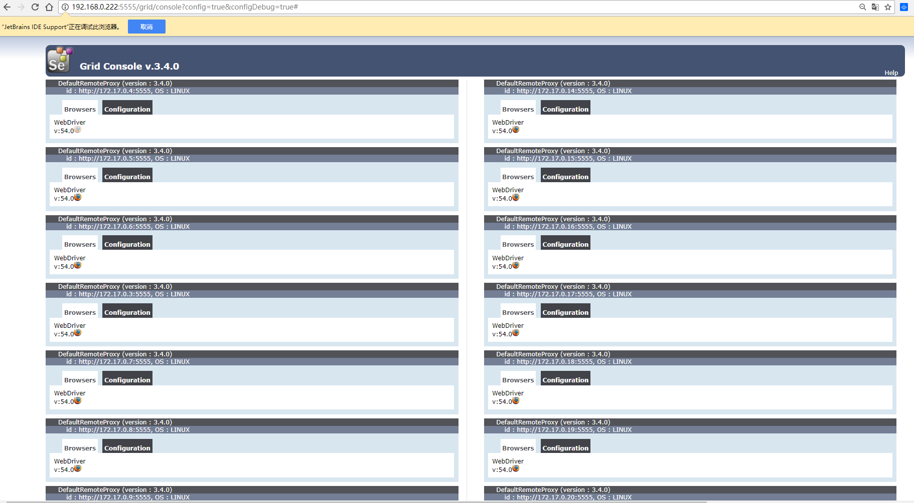
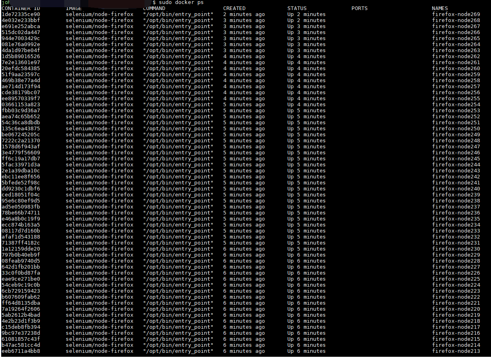

##  selenium

a selemium  java demo program ,you can run it by one stop , using `sh start.sh`; 

###  support for windows and Linux platform
####  if you are using windows, just `mvn install -U ,and then double click the lanshouxiangu.exe to run`

####  if you are using Linux, just ` login in the bash shell environment ,and just  sh start.sh to run`

